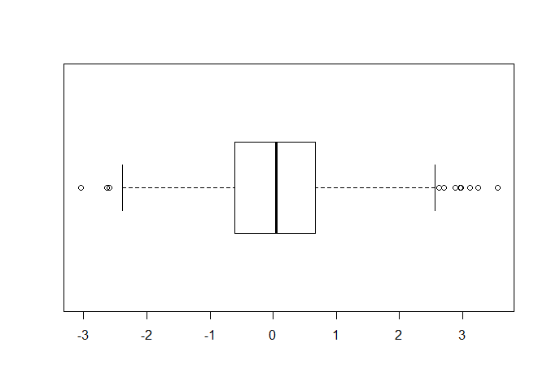
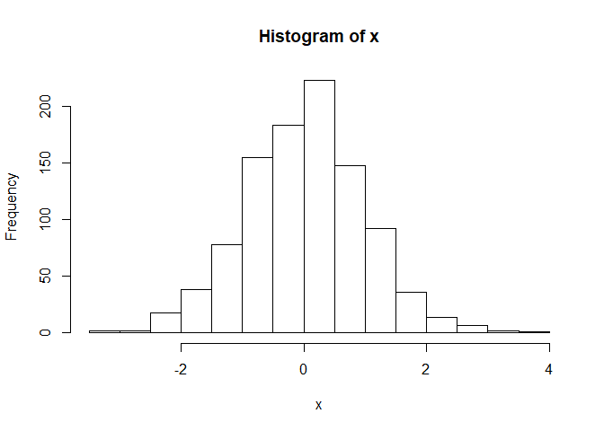
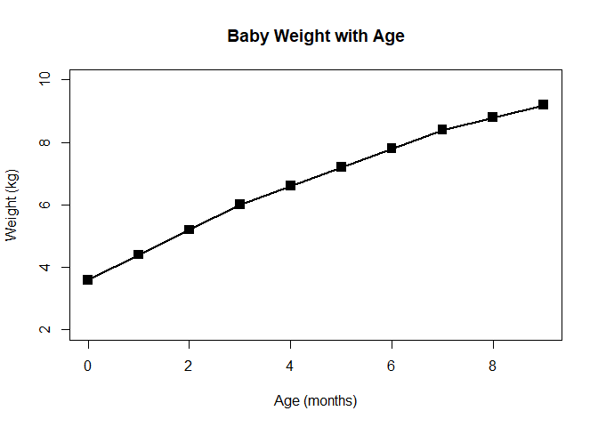
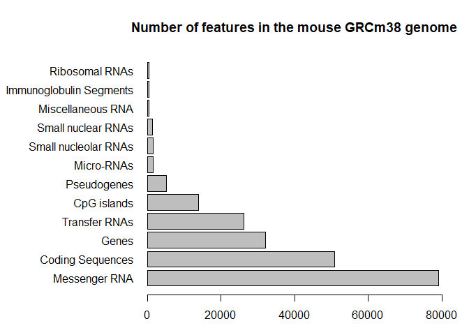
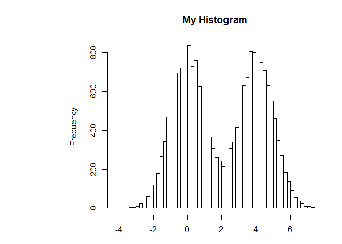
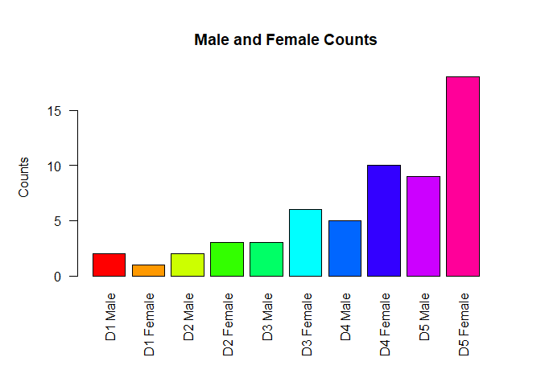
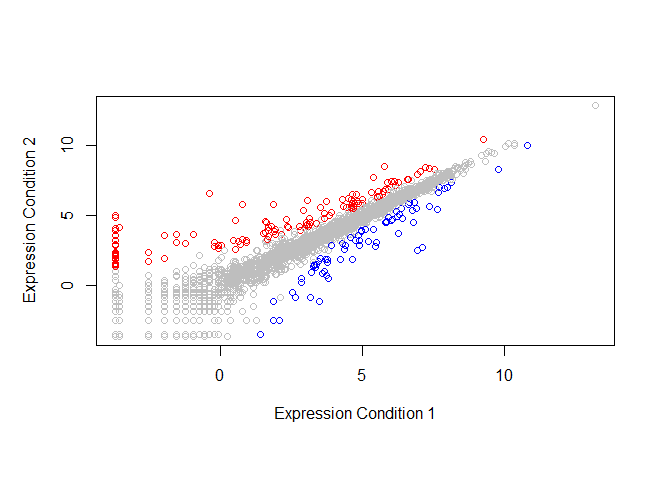
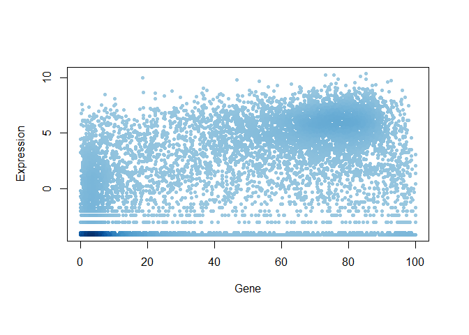

BIMM 143 Class 5
================
Rachel Goodridge
January 22, 2019

``` r
# Class 05 R graphics intro

# My first boxplot
x <- rnorm(1000,0)
boxplot(x, horizontal=TRUE)
```



``` r
summary(x)
```

    ##     Min.  1st Qu.   Median     Mean  3rd Qu.     Max. 
    ## -3.04831 -0.60822  0.04977  0.02625  0.66220  3.55120

``` r
hist(x)
```



``` r
# Hands on section 2
# Line plot
weight <- read.table("bimm143_05_rstats/weight_chart.txt", header=TRUE)
plot(weight,type="o",pch=15,cex=1.5,lwd=2,ylim=c(2,10),xlab="Age (months)",ylab="Weight (kg)",main="Baby Weight with Age")
```



``` r
# Barplot
mouse <- read.table("bimm143_05_rstats/feature_counts.txt", sep="\t", header=TRUE)
par(mar=c(3, 11, 4, 2))
barplot(mouse$Count,horiz=TRUE,names.arg=mouse$Feature,main="Number of features in the mouse GRCm38 genome",las=1,xlim=c(0,80000))
```



``` r
# Histograms
hist(c(rnorm(10000),rnorm(10000)+4),breaks=80,main="My Histogram")
```



``` r
# Hands on section 3
# Providing color vectors
gender <- read.table("bimm143_05_rstats/male_female_counts.txt",header=TRUE,sep="\t")
par(mar=c(7,5,5,3))
barplot(gender$Count,horiz=FALSE,col=rainbow(nrow(gender)),names.arg=gender$Sample,ylab="Counts",las=2,main="Male and Female Counts")
```



``` r
# Coloring by value
genes <- read.table("bimm143_05_rstats/up_down_expression.txt",header=TRUE,sep="\t")
palette(c("blue","gray","red"))
plot(genes$Condition1,genes$Condition2,type="p",xlab="Expression Condition 1",ylab="Expression Condition 2",col=genes$State)
```



``` r
# Dynamic use of color
meth <- read.table("bimm143_05_rstats/expression_methylation.txt",header=TRUE,sep="\t")
plot(meth$gene.meth,meth$expression,type="p",xlab="Gene",ylab="Expression",pch=20,col=densCols(meth$gene.meth,meth$expression))
```


