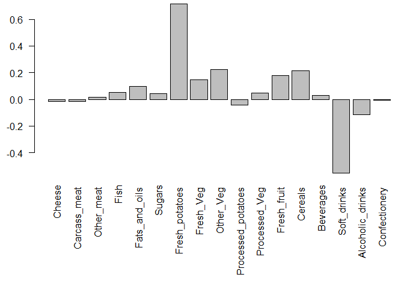

class08
================
Rachel Goodridge
February 5, 2019

### K-means Clustering

``` r
# Generate and plot some example data
tmp <- c(rnorm(30,-3), rnorm(30,3))
x <- cbind(x=tmp, y=rev(tmp))
plot(x)
```


``` r
# Use and plot the kmeans function
km <- kmeans(x,centers=2,nstart=20)
plot(x, col=km$cluster)
points(km$centers, col="blue", pch=15, cex=2)
```


### Hierarchical Clustering

``` r
# Calculate point (dis)similarity as Euclidean distance
dist_matrix <- dist(x)
# The hclust() function returns a hierarchical clustering model
hc <- hclust(d = dist_matrix)
plot(hc)
abline(h=6, col="red")
```


The cutree() function tells how to divide the data

``` r
# We can also use k=number of clusters we want
cutree(hc, h=6)
```

    ##  [1] 1 1 1 1 1 1 1 1 1 1 1 1 1 1 1 1 1 1 1 1 1 1 1 1 1 1 1 1 1 1 2 2 2 2 2
    ## [36] 2 2 2 2 2 2 2 2 2 2 2 2 2 2 2 2 2 2 2 2 2 2 2 2 2

``` r
# Using different hierarchical clustering methods
d <- dist_matrix

hc.complete <- hclust(d, method="complete")
plot(hc.complete)
```


``` r
hc.average <- hclust(d, method="average")
plot(hc.average)
```


``` r
hc.single <- hclust(d, method="single")
plot(hc.single)
```


Run hclust() on this overlapping data

``` r
x <- rbind(
 matrix(rnorm(100, mean=0, sd = 0.3), ncol = 2),
 matrix(rnorm(100, mean = 1, sd = 0.3), ncol = 2),
 matrix(c(rnorm(50, mean = 1, sd = 0.3),
 rnorm(50, mean = 0, sd = 0.3)), ncol = 2))
colnames(x) <- c("x", "y")

col <- as.factor( rep(c("c1","c2","c3"), each=50) )
plot(x, col=col)
```


``` r
plot(hclust(dist(x)))
abline(h=2, col="red")
abline(h=2.5, col="blue")
```


``` r
group2 <- cutree(hclust(dist(x)),k=2)
plot(x,col=group2)
```


``` r
group3 <- cutree(hclust(dist(x)),k=3)
plot(x,col=group3)
```


### Doing PCA in R

``` r
# Download the class data
mydata <- read.csv("https://tinyurl.com/expression-CSV",row.names=1)
# Show it in a data table
head(mydata)
```

    ##        wt1 wt2  wt3  wt4 wt5 ko1 ko2 ko3 ko4 ko5
    ## gene1  439 458  408  429 420  90  88  86  90  93
    ## gene2  219 200  204  210 187 427 423 434 433 426
    ## gene3 1006 989 1030 1017 973 252 237 238 226 210
    ## gene4  783 792  829  856 760 849 856 835 885 894
    ## gene5  181 249  204  244 225 277 305 272 270 279
    ## gene6  460 502  491  491 493 612 594 577 618 638

``` r
# Use PCA and then look at the attritubes
pca <- prcomp(t(mydata), scale=TRUE)
attributes(pca)
```

    ## $names
    ## [1] "sdev"     "rotation" "center"   "scale"    "x"       
    ## 
    ## $class
    ## [1] "prcomp"

``` r
# Plot how the data looks like in 2D
plot(pca$x[,1], pca$x[,2])
```


``` r
# Look at the Scree Plot
# Observe that PC1 accounts for almost all of the data
pca.var <- pca$sdev^2
pca.var.per <- round(pca.var/sum(pca.var)*100, 1)
barplot(pca.var.per, main="Scree Plot",xlab="Principal Component", ylab="Percent Variation")
```


Let's make the plot a bit more useful . . .

``` r
colvec <- colnames(mydata)
colvec[grep("wt", colvec)] <- "red"
colvec[grep("ko", colvec)] <- "blue"
plot(pca$x[,1], pca$x[,2], col=colvec, pch=16,
 xlab=paste0("PC1 (", pca.var.per[1], "%)"),
 ylab=paste0("PC2 (", pca.var.per[2], "%)"))
```


### Hands-on section worksheet for PCA

Section 1: PCA of UK food data

Checking your data

``` r
# Download and clean up the data
x <- read.csv("UK_foods.csv",row.names=1)
head(x)
```

    ##                England Wales Scotland N.Ireland
    ## Cheese             105   103      103        66
    ## Carcass_meat       245   227      242       267
    ## Other_meat         685   803      750       586
    ## Fish               147   160      122        93
    ## Fats_and_oils      193   235      184       209
    ## Sugars             156   175      147       139

Spotting major differences and trends

``` r
# Plot a rainbow barplot
barplot(as.matrix(x), beside=T, col=rainbow(nrow(x)))
```


``` r
# Plots that compare each country to one another
pairs(x, col=rainbow(10), pch=16)
```


PCA to the rescue

``` r
# Use the prcomp() PCA function
pca <- prcomp(t(x))
summary(pca)
```

    ## Importance of components:
    ##                             PC1      PC2      PC3       PC4
    ## Standard deviation     324.1502 212.7478 73.87622 4.189e-14
    ## Proportion of Variance   0.6744   0.2905  0.03503 0.000e+00
    ## Cumulative Proportion    0.6744   0.9650  1.00000 1.000e+00

``` r
# Plot PC1 vs PC2
plot(pca$x[,1], pca$x[,2], xlab="PC1", ylab="PC2", xlim=c(-270,500))
text(pca$x[,1], pca$x[,2], colnames(x), col=c("orange","red","blue","darkgreen"))
```


``` r
# Create a barplot to compare PC's
v <- round( pca$sdev^2/sum(pca$sdev^2) * 100 )
barplot(v, xlab="Principal Component", ylab="Percent Variation")
```


Digging deeper (variable loadings)

``` r
## Lets focus on PC1 as it accounts for > 90% of variance 
par(mar=c(10, 3, 0.35, 0))
barplot( pca$rotation[,1], las=2 )
```


``` r
# Now make the same barplot for PC2
barplot( pca$rotation[,2], las=2 )
```



``` r
# The inbuilt biplot() can be useful for small datasets 
biplot(pca)
```


Section 2: PCA of RNA-seq data

``` r
# Download and clean up the data
rna.data <- read.csv("expression.csv", row.names=1)
head(rna.data)
```

    ##        wt1 wt2  wt3  wt4 wt5 ko1 ko2 ko3 ko4 ko5
    ## gene1  439 458  408  429 420  90  88  86  90  93
    ## gene2  219 200  204  210 187 427 423 434 433 426
    ## gene3 1006 989 1030 1017 973 252 237 238 226 210
    ## gene4  783 792  829  856 760 849 856 835 885 894
    ## gene5  181 249  204  244 225 277 305 272 270 279
    ## gene6  460 502  491  491 493 612 594 577 618 638

``` r
# Take the transpose and plot the data 
pca <- prcomp(t(rna.data), scale=TRUE)
plot(pca$x[,1], pca$x[,2])
```


``` r
# Generate a scree plot 
pca.var.per <- round(pca$sdev^2/sum(pca.var)*100, 1)
barplot(pca.var.per, main="Scree Plot",xlab="Principal Component",ylab="Percent Variation")
```


