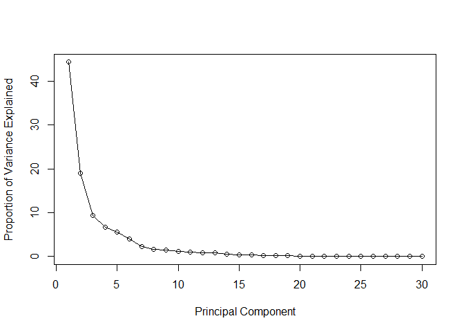
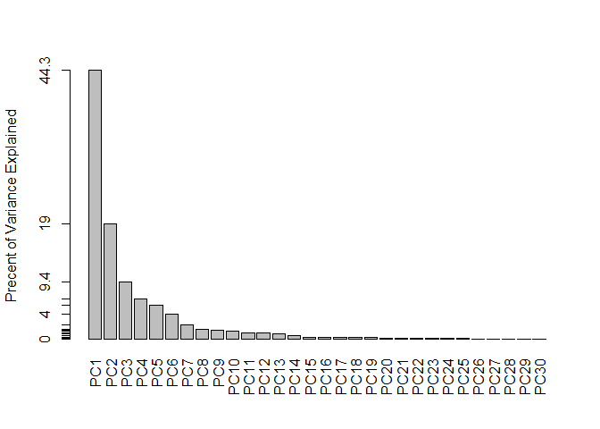
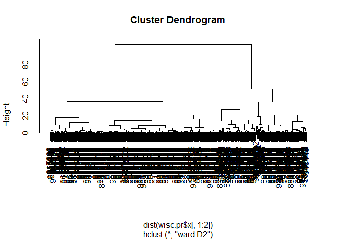
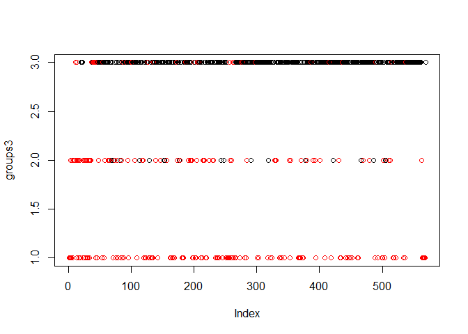
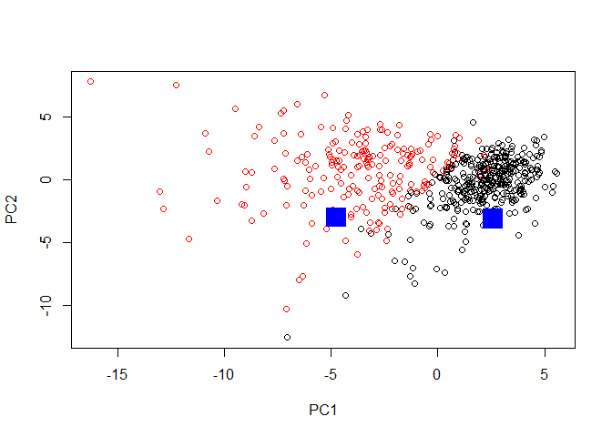

class09
================
Rachel Goodridge
February 7, 2019

### Hands-on section worksheet for PCA

### Section 1: Exploratory data analysis

Preparing the data

``` r
#Download data
wisc.df <- read.csv("WisconsinCancer.csv")
#Convert data to a matrix
wisc.data <- as.matrix(wisc.df[,3:32])
row.names(wisc.data) <- wisc.df$id
#Preview data
head(wisc.df)
```

    ##         id diagnosis radius_mean texture_mean perimeter_mean area_mean
    ## 1   842302         M       17.99        10.38         122.80    1001.0
    ## 2   842517         M       20.57        17.77         132.90    1326.0
    ## 3 84300903         M       19.69        21.25         130.00    1203.0
    ## 4 84348301         M       11.42        20.38          77.58     386.1
    ## 5 84358402         M       20.29        14.34         135.10    1297.0
    ## 6   843786         M       12.45        15.70          82.57     477.1
    ##   smoothness_mean compactness_mean concavity_mean concave.points_mean
    ## 1         0.11840          0.27760         0.3001             0.14710
    ## 2         0.08474          0.07864         0.0869             0.07017
    ## 3         0.10960          0.15990         0.1974             0.12790
    ## 4         0.14250          0.28390         0.2414             0.10520
    ## 5         0.10030          0.13280         0.1980             0.10430
    ## 6         0.12780          0.17000         0.1578             0.08089
    ##   symmetry_mean fractal_dimension_mean radius_se texture_se perimeter_se
    ## 1        0.2419                0.07871    1.0950     0.9053        8.589
    ## 2        0.1812                0.05667    0.5435     0.7339        3.398
    ## 3        0.2069                0.05999    0.7456     0.7869        4.585
    ## 4        0.2597                0.09744    0.4956     1.1560        3.445
    ## 5        0.1809                0.05883    0.7572     0.7813        5.438
    ## 6        0.2087                0.07613    0.3345     0.8902        2.217
    ##   area_se smoothness_se compactness_se concavity_se concave.points_se
    ## 1  153.40      0.006399        0.04904      0.05373           0.01587
    ## 2   74.08      0.005225        0.01308      0.01860           0.01340
    ## 3   94.03      0.006150        0.04006      0.03832           0.02058
    ## 4   27.23      0.009110        0.07458      0.05661           0.01867
    ## 5   94.44      0.011490        0.02461      0.05688           0.01885
    ## 6   27.19      0.007510        0.03345      0.03672           0.01137
    ##   symmetry_se fractal_dimension_se radius_worst texture_worst
    ## 1     0.03003             0.006193        25.38         17.33
    ## 2     0.01389             0.003532        24.99         23.41
    ## 3     0.02250             0.004571        23.57         25.53
    ## 4     0.05963             0.009208        14.91         26.50
    ## 5     0.01756             0.005115        22.54         16.67
    ## 6     0.02165             0.005082        15.47         23.75
    ##   perimeter_worst area_worst smoothness_worst compactness_worst
    ## 1          184.60     2019.0           0.1622            0.6656
    ## 2          158.80     1956.0           0.1238            0.1866
    ## 3          152.50     1709.0           0.1444            0.4245
    ## 4           98.87      567.7           0.2098            0.8663
    ## 5          152.20     1575.0           0.1374            0.2050
    ## 6          103.40      741.6           0.1791            0.5249
    ##   concavity_worst concave.points_worst symmetry_worst
    ## 1          0.7119               0.2654         0.4601
    ## 2          0.2416               0.1860         0.2750
    ## 3          0.4504               0.2430         0.3613
    ## 4          0.6869               0.2575         0.6638
    ## 5          0.4000               0.1625         0.2364
    ## 6          0.5355               0.1741         0.3985
    ##   fractal_dimension_worst
    ## 1                 0.11890
    ## 2                 0.08902
    ## 3                 0.08758
    ## 4                 0.17300
    ## 5                 0.07678
    ## 6                 0.12440

``` r
#How many malignant (M) and benign (B)?
table(wisc.df$diagnosis)
```

    ## 
    ##   B   M 
    ## 357 212

``` r
#Change M to 1 and B to 0
diagnosis <- as.numeric(wisc.df$diagnosis=="M")
```

Exploratory data analysis

``` r
#Q1: How many observations are in this dataset?
nrow(wisc.data)
```

    ## [1] 569

``` r
#Q2: How many variables/features in the data are suffixed with _mean?
length(grep("_mean",colnames(wisc.data)))
```

    ## [1] 10

``` r
#Q3: How many of the observations have a malignant diagnosis?
sum(diagnosis)
```

    ## [1] 212

### Section 2: Principal Component Analysis

Performing PCA

``` r
#Check the column means
colMeans(wisc.data)
```

    ##             radius_mean            texture_mean          perimeter_mean 
    ##            1.412729e+01            1.928965e+01            9.196903e+01 
    ##               area_mean         smoothness_mean        compactness_mean 
    ##            6.548891e+02            9.636028e-02            1.043410e-01 
    ##          concavity_mean     concave.points_mean           symmetry_mean 
    ##            8.879932e-02            4.891915e-02            1.811619e-01 
    ##  fractal_dimension_mean               radius_se              texture_se 
    ##            6.279761e-02            4.051721e-01            1.216853e+00 
    ##            perimeter_se                 area_se           smoothness_se 
    ##            2.866059e+00            4.033708e+01            7.040979e-03 
    ##          compactness_se            concavity_se       concave.points_se 
    ##            2.547814e-02            3.189372e-02            1.179614e-02 
    ##             symmetry_se    fractal_dimension_se            radius_worst 
    ##            2.054230e-02            3.794904e-03            1.626919e+01 
    ##           texture_worst         perimeter_worst              area_worst 
    ##            2.567722e+01            1.072612e+02            8.805831e+02 
    ##        smoothness_worst       compactness_worst         concavity_worst 
    ##            1.323686e-01            2.542650e-01            2.721885e-01 
    ##    concave.points_worst          symmetry_worst fractal_dimension_worst 
    ##            1.146062e-01            2.900756e-01            8.394582e-02

``` r
#Perform PCA
wisc.pr <- prcomp(wisc.data,scale=TRUE)
summary(wisc.pr)
```

    ## Importance of components:
    ##                           PC1    PC2     PC3     PC4     PC5     PC6
    ## Standard deviation     3.6444 2.3857 1.67867 1.40735 1.28403 1.09880
    ## Proportion of Variance 0.4427 0.1897 0.09393 0.06602 0.05496 0.04025
    ## Cumulative Proportion  0.4427 0.6324 0.72636 0.79239 0.84734 0.88759
    ##                            PC7     PC8    PC9    PC10   PC11    PC12
    ## Standard deviation     0.82172 0.69037 0.6457 0.59219 0.5421 0.51104
    ## Proportion of Variance 0.02251 0.01589 0.0139 0.01169 0.0098 0.00871
    ## Cumulative Proportion  0.91010 0.92598 0.9399 0.95157 0.9614 0.97007
    ##                           PC13    PC14    PC15    PC16    PC17    PC18
    ## Standard deviation     0.49128 0.39624 0.30681 0.28260 0.24372 0.22939
    ## Proportion of Variance 0.00805 0.00523 0.00314 0.00266 0.00198 0.00175
    ## Cumulative Proportion  0.97812 0.98335 0.98649 0.98915 0.99113 0.99288
    ##                           PC19    PC20   PC21    PC22    PC23   PC24
    ## Standard deviation     0.22244 0.17652 0.1731 0.16565 0.15602 0.1344
    ## Proportion of Variance 0.00165 0.00104 0.0010 0.00091 0.00081 0.0006
    ## Cumulative Proportion  0.99453 0.99557 0.9966 0.99749 0.99830 0.9989
    ##                           PC25    PC26    PC27    PC28    PC29    PC30
    ## Standard deviation     0.12442 0.09043 0.08307 0.03987 0.02736 0.01153
    ## Proportion of Variance 0.00052 0.00027 0.00023 0.00005 0.00002 0.00000
    ## Cumulative Proportion  0.99942 0.99969 0.99992 0.99997 1.00000 1.00000

``` r
#Q4: From your results, what proportion of the original variance is captured by the first principal components (PC1)?
0.4427
```

    ## [1] 0.4427

``` r
#Q5: How many principal components (PCs) are required to describe at least 70% of the original variance in the data?
3
```

    ## [1] 3

``` r
#Q6: How many principal components (PCs) are required to describe at least 90% of the original variance in the data?
7
```

    ## [1] 7

Interpreting PCA results

``` r
#Create a biplot
biplot(wisc.pr)
```


``` r
#Create a scatter plot of PC1 vs PC2
plot(wisc.pr$x[,1],wisc.pr$x[,2],col=(diagnosis+1),xlab="PC1",ylab="PC2")
```


``` r
#Create a scatter plot of PC1 vs PC3
plot(wisc.pr$x[,1],wisc.pr$x[,3],col=(diagnosis+1),xlab="PC1",ylab="PC3")
```


Variance explained

``` r
#Calculate variance
pr.var <- wisc.pr$sdev^2
#Proportion of Variance
pve <- round((pr.var/sum(pr.var))*100,1)
#Plot variance
plot(pve,xlab = "Principal Component",ylab = "Proportion of Variance Explained",type = "o")
```



``` r
#Make a scree plot
barplot(pve,ylab = "Precent of Variance Explained",names.arg=paste0("PC",1:length(pve)),las=2,axes = FALSE)
axis(2,at=pve,labels=round(pve,2))
```



### Section 3: Hierarchical clustering

Hierarchical clustering of case data

``` r
#Scale the data
data.scaled <- scale(wisc.data)
round(apply(data.scaled,2,sd),1)
```

    ##             radius_mean            texture_mean          perimeter_mean 
    ##                       1                       1                       1 
    ##               area_mean         smoothness_mean        compactness_mean 
    ##                       1                       1                       1 
    ##          concavity_mean     concave.points_mean           symmetry_mean 
    ##                       1                       1                       1 
    ##  fractal_dimension_mean               radius_se              texture_se 
    ##                       1                       1                       1 
    ##            perimeter_se                 area_se           smoothness_se 
    ##                       1                       1                       1 
    ##          compactness_se            concavity_se       concave.points_se 
    ##                       1                       1                       1 
    ##             symmetry_se    fractal_dimension_se            radius_worst 
    ##                       1                       1                       1 
    ##           texture_worst         perimeter_worst              area_worst 
    ##                       1                       1                       1 
    ##        smoothness_worst       compactness_worst         concavity_worst 
    ##                       1                       1                       1 
    ##    concave.points_worst          symmetry_worst fractal_dimension_worst 
    ##                       1                       1                       1

``` r
#Calculate the Euclidean distance
data.dist <- dist(data.scaled)
#Create a hierarchical clustering model
wisc.hclust <- hclust(data.dist,method="complete")
```

Results of hierarchical clustering

``` r
#Plot a cluster dendrogram
plot(wisc.hclust)
```


### Section 5: Combining methods

Clustering on PCA results

``` r
#Create and plot a cluster dendrogram
pc.hclust <- hclust(dist(wisc.pr$x[,1:2]),method="ward.D2")
plot(pc.hclust)
```



``` r
#Break the tree into clusters
groups3 <- (cutree(pc.hclust,k=3))
table(groups3,diagnosis)
```

    ##        diagnosis
    ## groups3   0   1
    ##       1   0 112
    ##       2  18  65
    ##       3 339  35

``` r
#Plot the clusters
plot(groups3,col=diagnosis+1)
```



``` r
#Plot PC1 vs PC2 vs PC3 in 3D
library(rgl)
plot3d(wisc.pr$x[,1:3], xlab="PC 1", ylab="PC 2", zlab="PC 3", cex=1.5, size=1, type="s", col=diagnosis+1)
```

### Section 7: Prediction

``` r
#Download new data
new <- read.csv("https://tinyurl.com/new-samples-CSV")
#Predict how the new data will fit into the existing PCA model
npc <- predict(wisc.pr, newdata=new)
#Plot the prediction over the PCA model
plot(wisc.pr$x[,1:2], col=diagnosis+1)
points(npc[,1], npc[,2], col="blue", pch=15, cex=3)
```


