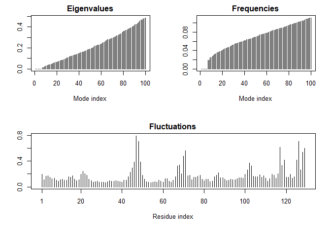

Class 13
================

Section 1: In silico docking of drugs to HIV-1 protease
-------------------------------------------------------

### Obtaining and inspecting our input structure

``` r
library(bio3d)
file.name <- get.pdb("1hsg")
```

    ## Warning in get.pdb("1hsg"): ./1hsg.pdb exists. Skipping download

``` r
hiv <- read.pdb(file.name)
hiv
```

    ## 
    ##  Call:  read.pdb(file = file.name)
    ## 
    ##    Total Models#: 1
    ##      Total Atoms#: 1686,  XYZs#: 5058  Chains#: 2  (values: A B)
    ## 
    ##      Protein Atoms#: 1514  (residues/Calpha atoms#: 198)
    ##      Nucleic acid Atoms#: 0  (residues/phosphate atoms#: 0)
    ## 
    ##      Non-protein/nucleic Atoms#: 172  (residues: 128)
    ##      Non-protein/nucleic resid values: [ HOH (127), MK1 (1) ]
    ## 
    ##    Protein sequence:
    ##       PQITLWQRPLVTIKIGGQLKEALLDTGADDTVLEEMSLPGRWKPKMIGGIGGFIKVRQYD
    ##       QILIEICGHKAIGTVLVGPTPVNIIGRNLLTQIGCTLNFPQITLWQRPLVTIKIGGQLKE
    ##       ALLDTGADDTVLEEMSLPGRWKPKMIGGIGGFIKVRQYDQILIEICGHKAIGTVLVGPTP
    ##       VNIIGRNLLTQIGCTLNF
    ## 
    ## + attr: atom, xyz, seqres, helix, sheet,
    ##         calpha, remark, call

Q1: What is the name of the two non protein resid values in this structure? What does resid correspond to and how would you get a listing of all reside values in this structure? \[HOH (127), MK1 (1)\] 198 protein atoms residues / C alpha atoms 0 nucleic acid atoms residues / phosphate atoms 128 non-protein / nucleic atoms residues

### Prepare initial protein and ligand input files

``` r
prot <- trim.pdb(hiv,"protein")
lig <- trim.pdb(hiv,"ligand")
write.pdb(prot,file="1hsg_protein.pdb")
write.pdb(lig,file="1hsg_ligand.pdb")
```

### Using AutoDockTools to setup protein docking input

Q2: Can you locate the binding site visually? Note that crystal structures normally lack hydrogen atoms, why? Yes, I can visually locate the binding site. Hydrogens are too small to be seen in normal crystal structures.

Q3: Look at the charges. Does it make sense (e.g. based on your knowledge of the physiochemical properties of amino acids)? Yes, the charges make sense.

Read in autodoc results
-----------------------

``` r
library(bio3d)
res <- read.pdb("all.pdbqt",multi=TRUE)
write.pdb(res,file="results.pdb")
ori <- read.pdb("1hsg_ligand.pdbqt")
rmsd(ori,res)
```

    ##  [1]  0.649  4.206 11.110 10.529  4.840 10.932 10.993  3.655 10.996 11.222
    ## [11] 10.567 10.372 11.019 11.338  8.390  9.063  8.254  8.978

Normal Mode Analysis
--------------------

``` r
library(bio3d)
pdb <- read.pdb("1HEL")
```

    ##   Note: Accessing on-line PDB file

``` r
m <- nma(pdb)
```

    ##  Building Hessian...     Done in 0.01 seconds.
    ##  Diagonalizing Hessian...    Done in 0.12 seconds.

``` r
plot(m)
```



``` r
mktrj(m,mode=7,file="nma_7.pdb")
```
