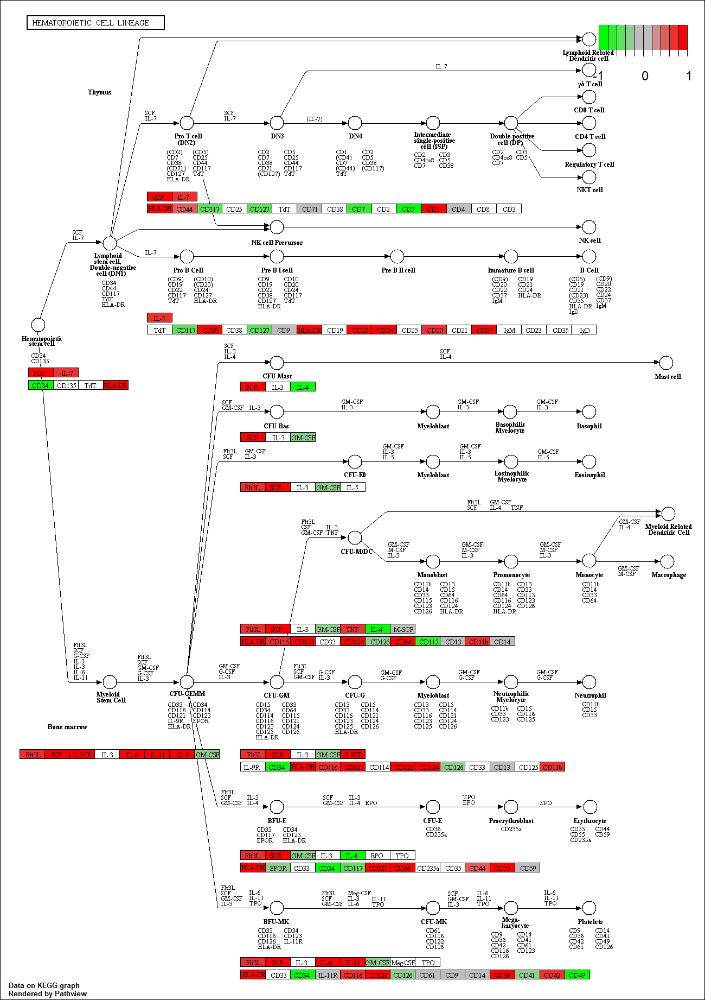
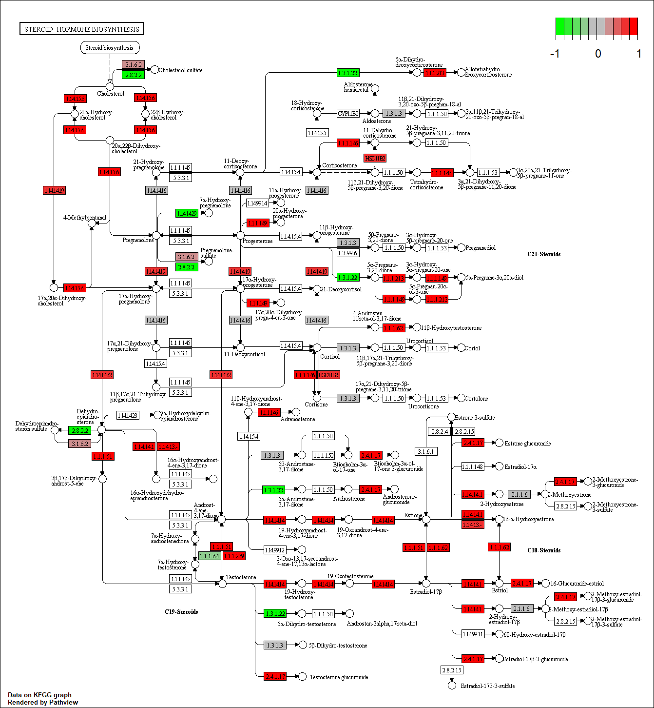

```{r setup, include=FALSE}
knitr::opts_chunk$set(echo = TRUE)
```

## Differential Expression Analysis

```{r deseq_load, message=FALSE}
library(DESeq2)
```

Load our data files

```{r}
metaFile <- "data/meta.csv"
countFile <- "data/feature.csv"

# Import metadata and take a peak
colData = read.csv(metaFile, row.names=1)
head(colData)

# Import countdata and take a peak
countData = read.csv(countFile, row.names=1)
head(countData)
```

Remove the troublesome first column from countData

```{r}
countData <- as.matrix(countData[,-1])
head(countData)
```

Check now that my metadata rows and coldata columns match!

```{r}
all(rownames(colData)==colnames(countData))
```

Filter countData to exclude genes where we have 0 

```{r}
countData = countData[rowSums(countData)!=0,]
head(countData)
```

#### Running DESeq2

```{r}
dds = DESeqDataSetFromMatrix(countData=countData,colData=colData,design=~condition)
dds = DESeq(dds)
```

Lets get our results

```{r}
res = results(dds, contrast=c("condition", "hoxa1_kd", "control_sirna"))
summary(res)
```

#### Volcano plot

```{r}
mycols <- rep("gray",nrow(res))
mycols[abs(res$log2FoldChange) > 2] <- "red"
mycols[(res$padj < 0.01) & (abs(res$log2FoldChange) > 2)] <- "blue"
plot(res$log2FoldChange,-log(res$padj),col=mycols,xlab="Log2(FoldChange)",ylab="-Log(P-value)")
```

#### Adding gene annotation

```{r}
library("AnnotationDbi")
library("org.Hs.eg.db")

columns(org.Hs.eg.db)
```

Use the mapIDs() function multiple times to add SYMBOL, ENTREZID, and GENENAME annotation to our results

```{r}
res$symbol = mapIds(org.Hs.eg.db,keys=row.names(res),keytype="ENSEMBL",column="SYMBOL",multiVals="first")

res$entrez = mapIds(org.Hs.eg.db,keys=row.names(res),keytype="ENSEMBL",column="ENTREZID",multiVals="first")

res$name = mapIds(org.Hs.eg.db,keys=row.names(res),keytype="ENSEMBL",column="GENENAME",multiVals="first")

head(res, 10)
```

Finally for this section let’s reorder these results by adjusted p-value and save them to a CSV file in your current project directory.

```{r}
res = res[order(res$pvalue),]
write.csv(res, file="deseq_results.csv")
```

## Pathway Analysis

#### KEGG pathways

```{r}
library(pathview)
library(gage)
library(gageData)
```

```{r}
data(kegg.sets.hs)
data(sigmet.idx.hs)
# Focus on signaling and metabolic pathways only
kegg.sets.hs = kegg.sets.hs[sigmet.idx.hs]
# Examine the first 3 pathways
head(kegg.sets.hs, 3)
```

The main gage() function requires a named vector of fold changes, where the names of the values are the Entrez gene IDs.

Note that we used the mapIDs() function above to obtain Entrez gene IDs (stored in res_entrez) and we have the fold change results from DESeq2 analysis (stored in res_log2FoldChange).

```{r}
foldchanges = res$log2FoldChange
names(foldchanges) = res$entrez
head(foldchanges)
```

Now, let’s run the gage pathway analysis.

```{r}
# Get the results
keggres = gage(foldchanges, gsets=kegg.sets.hs)
```

Now lets look at the object returned from gage().

```{r}
attributes(keggres)
```

Lets look at the first few down (less) pathway results

```{r}
# Look at the first few down (less) pathways
head(keggres$less)
```

Now, let’s try out the pathview() function from the pathview package to make a pathway plot with our RNA-Seq expression results shown in color.

```{r}
pathview(gene.data=foldchanges, pathway.id="hsa04110")
```


You can play with the other input arguments to pathview() to change the display in various ways including generating a PDF graph.

```{r message=FALSE}
# A different PDF based output of the same data
pathview(gene.data=foldchanges, pathway.id="hsa04110", kegg.native=FALSE)
```

Now, let’s process our results a bit more to automagicaly pull out the top 5 upregulated pathways, then further process that just to get the pathway IDs needed by the pathview() function. We’ll use these KEGG pathway IDs for pathview plotting below.

```{r}
## Focus on top 5 upregulated pathways here for demo purposes only
keggrespathways <- rownames(keggres$greater)[1:5]

# Extract the 8 character long IDs part of each string
keggresids = substr(keggrespathways, start=1, stop=8)
keggresids
```

Finally, lets pass these IDs in keggresids to the pathview() function to draw plots for all the top 5 pathways.

```{r message=FALSE}
pathview(gene.data=foldchanges, pathway.id=keggresids, species="hsa")
```







## Gene Ontology (GO)

```{r}
data(go.sets.hs)
data(go.subs.hs)

# Focus on Biological Process subset of GO
gobpsets = go.sets.hs[go.subs.hs$BP]
gobpres = gage(foldchanges, gsets=gobpsets, same.dir=TRUE)

lapply(gobpres, head)
```

